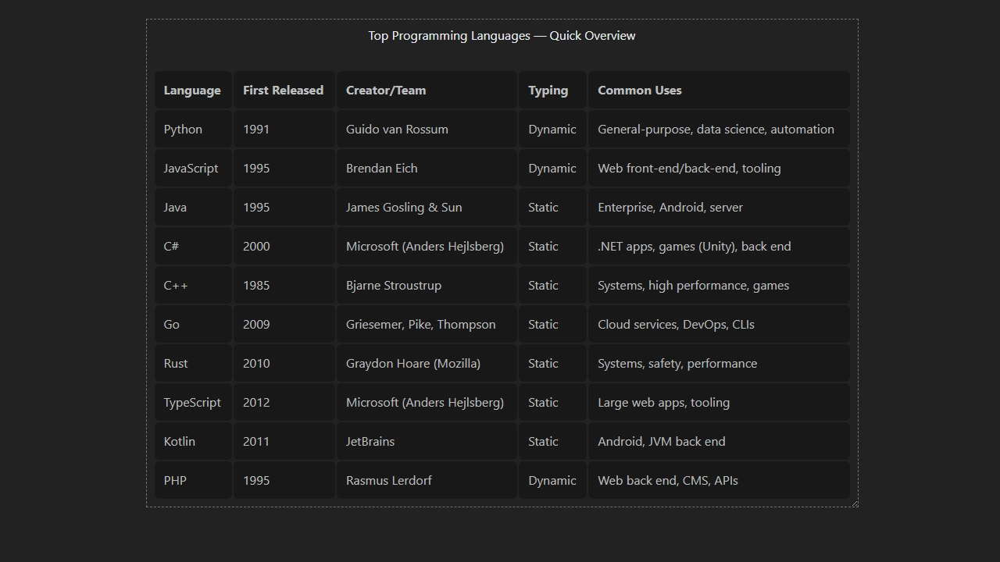

# Responsive Table

A lightweight web component that makes regular HTML tables easier to use on small screens.

It keeps your original table markup, switches to a stacked responsive layout below a configurable breakpoint, and can optionally add collapsible rows for denser mobile views.



## Installation

```bash
npm install responsive-table
```

## Usage

```js
import 'responsive-table';
```

```html
<responsive-table
	breakpoint="800"
	collapsible>
	<table>
		<caption>
			Top Programming Languages - Quick Overview
		</caption>
		<thead>
			<tr>
				<th scope="col">Language</th>
				<th scope="col">First Released</th>
				<th scope="col">Creator/Team</th>
				<th scope="col">Typing</th>
				<th scope="col">Common Uses</th>
			</tr>
		</thead>
		<tbody>
			<tr>
				<td>Python</td>
				<td>1991</td>
				<td>Guido van Rossum</td>
				<td>Dynamic</td>
				<td>General-purpose, data science, automation</td>
			</tr>
		</tbody>
	</table>
</responsive-table>
```

## Attributes

| Attribute     | Type      | Default | Description                                                                       |
| ------------- | --------- | ------- | --------------------------------------------------------------------------------- |
| `breakpoint`  | `number`  | `768`   | Width in pixels at which the component switches to the stacked responsive layout. |
| `collapsible` | `boolean` | `false` | Enables per-row expand/collapse controls in responsive mode.                      |

## How It Works

- Wrap a semantic HTML table in `<responsive-table>`.
- Above the breakpoint, the table behaves like a normal table.
- Below the breakpoint, the table is converted into a stacked card-like layout.
- When `collapsible` is present, each responsive row gets a dedicated toggle button.

## Demo

The repository contains a demo page that is intended to be published via GitHub Pages from the `docs/` directory.

## Inspiration

The responsive table layout in this project is inspired by the CSS-Tricks article [Responsive Data Tables](https://css-tricks.com/responsive-data-tables/) by Chris Coyier.

This package takes that idea and wraps it in a reusable web component so it can be dropped into projects with minimal setup.

## Development

```bash
npm install
npm run dev
```

### Build commands

```bash
npm run build
npm run build:lib
npm run build:site
```

## License

[MIT](./LICENSE)
